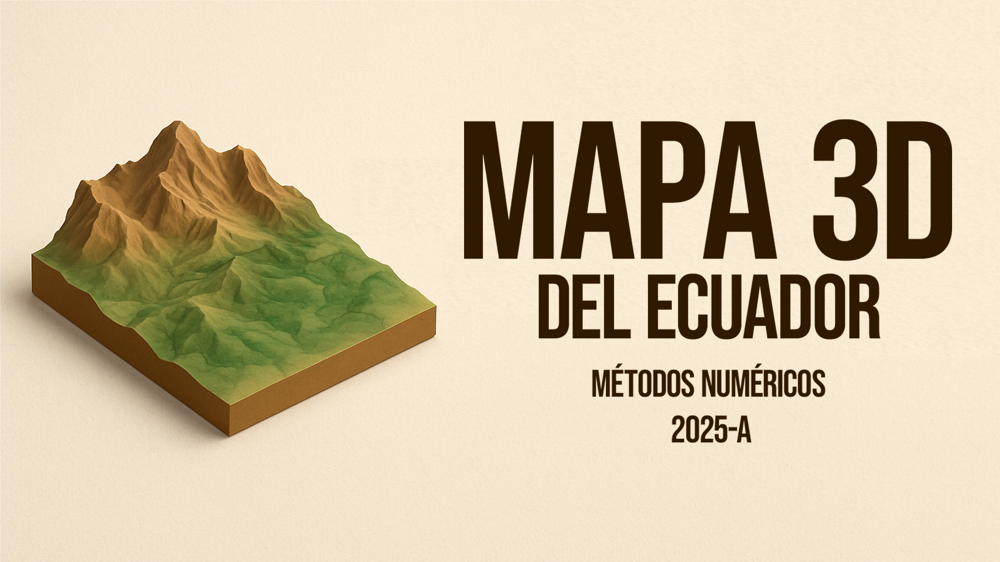

<div align="center">
  
</div>


> **Generador de modelos 3D imprimibles de la topografía del Ecuador continental**  
> *Proyecto académico de Métodos Numéricos - Universidad*

# Mapa 3D Ecuador

Proyecto para generar modelos 3D imprimibles del territorio continental ecuatoriano a partir de datos de elevación geográfica.

## Objetivo

Crear un objeto 3D (formato STL) con escala realista de una región determinada del Ecuador, utilizando datos de elevación y permitiendo segmentación geográfica y política, además de suavizado de superficie y verificación de imprimibilidad.

## Funcionalidades

- Descarga y procesamiento de datos de elevación (archivos HGT).
- Filtrado de datos para el Ecuador continental.
- Interfaz gráfica para seleccionar y segmentar áreas geográficas.
- Generación de modelos 3D en formato STL listos para impresión.
- Algoritmo de suavizado de superficie.
- Segmentación por división política.
- Previsualización de áreas y modelos generados.
- Verificación de imprimibilidad y obtención de parámetros de impresión (tiempo, peso, etc).

## Requisitos

- Python 3.13+
- PyQt6
- numpy, matplotlib, otros (ver `requirements.txt`)

## Uso

1. Instale los requisitos:
   ```
   pip install -r requirements.txt
   ```
2. Ejecute la aplicación:
   ```
   python main.py
   ```
3. Siga la interfaz para seleccionar el área, procesar los datos y generar el modelo 3D.

## Estructura del proyecto

- `core/`: Procesamiento de datos y generación de STL.
- `data/`: Archivos de datos geográficos.
- `outputs/`: Modelos STL generados.
- `previews/`: Imágenes de previsualización.
- `ui/`: Componentes de interfaz gráfica.

## Créditos

Desarrollado por [Harry Guajan - Michael Yanez - Joel Tinitana - Francis Bravo].

## Licencia

MIT
